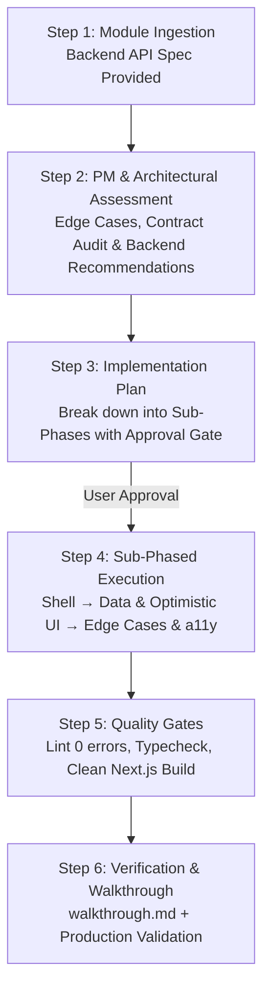

# WORKFLOW.md — Enterprise Feature Development & API Integration Lifecycle

**Version:** 1.0  
**Target Standard:** Enterprise-Grade / Production SaaS (Go-to-Market Ready)  
**Roles & Mandate:** Senior Frontend Lead • Product Manager • Lead UI/UX Designer  

---

## 1. Core Philosophy & Mindset

SyncSpace is engineered as a commercial, production-ready product for real teams and engineering organizations. We do not build prototypes or demo applications. Every feature module must meet strict standards of **visual elegance**, **instant perceived speed**, **rock-solid reliability**, and **defensive edge-case handling**.

### Three Immutable Principles
1. **Never Blindly Integrate**: Do not implement backend APIs without critical evaluation. If a backend contract is inefficient, lacks idempotency, misses pagination, or overlooks an edge case, propose a clean backend specification first.
2. **Product & UX Polish First**: Every screen must have designed empty states, error boundaries, layout skeleton loaders (never generic centered spinners), tactile button responses, and full keyboard navigation.
3. **Sub-Phase Discipline**: Never build a complex module in a single monolithic pass. Break large features into self-contained, reviewable, and testable sub-phases.

---

## 2. The 6-Step Module Lifecycle



---

### Step 1: Module Ingestion & Specification Review
When a backend module specification is provided:
* Thoroughly read all endpoints, HTTP methods, request bodies, query parameters, and response structures.
* Map endpoints against existing frontend feature boundaries (`src/features/<module>`).
* Identify UI dependencies (modals, tables, drawers, kanban columns, charts).

### Step 2: PM & Technical Assessment (Edge-Case Discovery)
Before writing any code, evaluate the contract from a **Product Manager** and **Senior Frontend Lead** perspective:
* **Contract Integrity**: Are routes RESTful? Are parameters standardized? Is the response wrapped in the unified `{ success, message, data, meta }` envelope?
* **Edge Cases**:
  * What happens on slow/offline networks?
  * How are partial failures handled?
  * What if a list contains 0 items? What if it contains 5,000 items?
  * Are concurrent mutations protected against race conditions?
  * Are permission constraints (RBAC: Owner, Admin, Member) clear for every UI action?
* **Backend Recommendations Protocol**: If changes are needed on the backend, provide a structured proposal:
  ```markdown
  ### 🛠️ Backend Recommendations for Module [Name]
  - **Endpoint**: `PATCH /workspaces/:wId/tasks/:tId/move`
  - **Issue**: Lacks column optimistic sort order in response.
  - **Proposed Fix**: Return `{ task, affectedColumnIds, updatedOrder }`.
  - **Rationale**: Prevents double-fetching board data on drag-and-drop.
  ```

### Step 3: Sub-Phased Implementation Plan (`implementation_plan.md`)
Every module must have a documented plan broken into discrete sub-phases:
* **Sub-Phase A (Visual Shell & Skeletons)**: UI layout, Radix primitives, typography, empty states, and skeleton screens.
* **Sub-Phase B (Data Layer & Mutations)**: Zod validation schemas, TanStack Query hooks, cache key invalidation, and optimistic mutations with rollback.
* **Sub-Phase C (Real-Time, RBAC & Polish)**: Socket.IO events, role-based visibility gates (`usePermissions`), keyboard accessibility, and tooltips.
* **Approval Gate**: Stop and obtain user approval before executing code changes.

### Step 4: Sub-Phased Code Execution

#### 4.1 UI & Design System Standards
* Follow the **SyncSpace Signature — Serious Software** design system:
  * **Typography**: Plus Jakarta Sans (`--font-sans`).
  * **Palette**: Electric Indigo primary (`#4648d4`), Emerald secondary (`#006c49`), Warm Amber tertiary (`#904900`).
  * **Surfaces**: Material Design 3 surface container layering (`bg-card`, `bg-background`, `border-border`).
  * **Tactile Feedback**: 1px inset top-border on primary buttons (`border-t border-white/20`), 98% press scale (`active:scale-[0.98]`).
  * **Pill Badges**: Status and priority chips use `rounded-full` geometry.
* **Skeleton Screens**: Loading states MUST mirror the exact layout geometry of the loaded content (no generic centered spinners for page layouts).
* **Empty States**: Must never be dead ends. Always include an icon, explanatory copy, and a primary action button (e.g., "Create Project", "Invite Member").

#### 4.2 State Management & Performance Architecture
* **Server State**: Managed strictly by TanStack Query v5 with normalized cache keys.
* **Optimistic UI**: High-frequency actions (task reordering, status toggling, comment posting) MUST update the cache immediately (`onMutate`) and roll back smoothly on failure (`onError`).
* **Global Client State**: Zustand v5 with selective persistence (`useAuthStore`, `useWorkspaceStore`).
* **Hydration Safety**: Use `useMounted` (`useSyncExternalStore`) to guard client-only UI and prevent cascading renders or SSR hydration mismatch.
* **Debounced Inputs**: Search bars and live filters must be debounced by 300ms.

#### 4.3 Accessibility (a11y) & Usability
* Full keyboard navigation (focus visible rings, `Escape` key to close dialogs, arrow keys for command palettes/menus).
* Explicit `aria-label` and `htmlFor` attributes on all form controls, icon buttons, and color swatches.
* High contrast compliance (WCAG 2.1 AA minimum 4.5:1 ratio across both Light and Dark themes).

### Step 5: Enterprise Quality Gates (Pre-Commit Verification)
Before declaring any sub-phase or module complete, the code MUST pass all 3 quality gates:
1. **ESLint Gate**: `npm run lint` must exit with **0 errors**.
2. **TypeScript Gate**: `npx tsc --noEmit` must exit with **0 errors** (strict mode, zero `any`).
3. **Build Gate**: `npx next build` must compile cleanly with **0 route collisions and 0 hydration warnings**.

### Step 6: Walkthrough & Delivery (`walkthrough.md`)
* Create or update `walkthrough.md` documenting:
  * Features and sub-phases delivered.
  * Files modified and created.
  * Automated test/build results.
  * Step-by-step user testing checklist for manual verification.

---

## 3. Communication & Collaboration Agreement

| Trigger | Agent Responsibility |
|---|---|
| **Backend API Spec Received** | Run Step 1 & Step 2 immediately. Highlight gaps, edge cases, and backend suggestions. |
| **Missing Endpoint or Contract Flaw** | Provide concrete request/response payload recommendations for the backend developer. |
| **Complex Feature (> 3 screens/endpoints)** | Enforce sub-phases so work is delivered and tested incrementally. |
| **Ambiguous Product Requirement** | Frame specific trade-offs and options from a PM/UI perspective rather than guessing. |
| **Quality Gate Failure** | Resolve all lint/type/build errors before asking the user to review. |

---

*This document is permanently locked as our operating standard for all current and future feature development in SyncSpace.*
