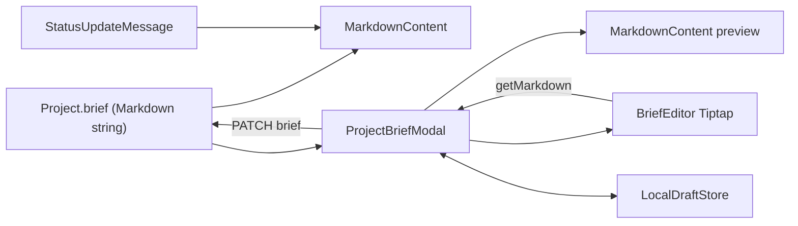

# Implementation Plan — Project Brief Editor & Markdown Renderer

**Status:** Approved direction (Tiptap). **Not started.** Stop for approval before each phase ships.
**Scope:** Project brief editor modal, brief viewer on the Overview tab, and a shared Markdown renderer.

---

## 1. Why

The modal shell, empty state, and templates are good. The engine underneath is not.

**Renderer** — `MarkdownRenderer` in `src/features/project/components/project-brief-modal.tsx` splits content by `\n` and renders line by line. As a result:

- Inline formatting shows raw: `**bold**`, `*italic*`, `` `code` ``, `[links](url)`. All three templates use bold, so templated briefs look broken.
- Numbered lists become plain paragraphs (the RFC template uses them).
- Fenced code blocks render as one `
` per line, fences visible.
- Tables render as pipe text, although the toolbar inserts them.
- No nested lists, no multi-line paragraphs or quotes. Keys are array indexes.

**Editor** — plain `<textarea>` with string splicing:

- Line formats (H1, lists, quote) insert at the cursor, not at line start. No toggling. Multi-line selections only get the first prefix.
- Programmatic `setContent` breaks native undo. Cursor restore relies on `setTimeout`.
- `Tab` is captured to insert spaces, so keyboard users can't leave the field inside the dialog (a11y bug).
- No list continuation on Enter, no Cmd/Ctrl+B / I.
- Esc, X, overlay, and Cancel discard the draft silently. No dirty indicator, no draft recovery.
- `void handleSave()` over `mutateAsync` leaves an unhandled rejection on failure. Save stays enabled with no changes. Hint says Ctrl+Enter even on macOS.
- Split mode has no scroll sync. The mode switcher has no pressed state for assistive tech.
- No enforced length limit (backend max unconfirmed).

**Viewer** — long briefs render at full height; checklists look interactive but are read-only. Status-update messages are Markdown per the backend doc but render as `whitespace-pre-wrap` text.

---

## 2. Decisions

- **Editor:** Tiptap (ProseMirror), headless, styled with the existing modal and toolbar design. Reads and writes the same Markdown string the API already stores.
- **Renderer:** `react-markdown` + `remark-gfm` + `rehype-highlight`, styled via `@tailwindcss/typography` mapped to SyncSpace tokens. Raw HTML stays disabled (no `rehype-raw`), so no sanitizer is required.
- **Code highlighting:** lowlight in both places (Tiptap code block + `rehype-highlight`) so editor and viewer match.
- **Loading:** Tiptap loads only when the brief modal opens (`next/dynamic`, `ssr: false`). The modal is already dynamically imported in the project detail page.
- **Mode switcher:** Write / Preview / Split becomes **Edit / Preview**. A Markdown-source toggle is out of scope for this wave.

### Packages (verify current stable versions and React 19 peers at install)

- Renderer: `react-markdown`, `remark-gfm`, `rehype-highlight`, `@tailwindcss/typography`
- Editor: `@tiptap/react`, `@tiptap/pm`, `@tiptap/starter-kit`, task list + task item, table, placeholder, `@tiptap/extension-code-block-lowlight`, `lowlight`, and Tiptap's Markdown extension

Before installing, read the relevant guides in `node_modules/next/dist/docs/` (per `AGENTS.md`) for dynamic imports and client components in Next.js 16.

### Accepted trade-offs

- The Markdown serializer normalizes formatting (for example `*` bullets become `-`). Existing briefs reformat on first save.
- Raw HTML inside a brief is dropped.
- Editor bundle is larger; it only loads inside the modal.

---

## 3. Architecture

### Planned files

- `src/components/common/markdown/markdown-content.tsx` — shared renderer
- `src/components/common/markdown/markdown-components.tsx` — element overrides (links, tables, task items, code)
- `src/features/project/components/brief-editor/brief-editor.tsx` — Tiptap instance and extensions
- `src/features/project/components/brief-editor/brief-editor-toolbar.tsx` — commands with active states
- `src/features/project/hooks/use-brief-draft.ts` — dirty tracking and local draft persistence
- Update: `project-brief-modal.tsx` (shell stays; engine swapped), `project-overview-tab.tsx`, `src/app/globals.css` (`@plugin "@tailwindcss/typography";`)
- Remove: hand-written `MarkdownRenderer`

---

## 4. Phases

### Phase 0 — Backend check (completed)

1. **Maximum brief length:** Confirmed via backend DTO (`create-project.dto.ts`) — **No length limits enforced on backend.** The frontend editor will display word count and reading time without artificial character restrictions.
2. **Stale-write protection:** Logged for future evaluation in `docs/backend-requests/03_PROJECT_BRIEF_SPECS.md` before implementing Phase D interactive checklists in the viewer.

Phases A–C proceed immediately.

### Phase A — Shared renderer (Completed)

- [x] Installed `react-markdown`, `remark-gfm`, `rehype-highlight`, and `@tailwindcss/typography`.
- [x] Added `@plugin "@tailwindcss/typography";` and `.hljs-*` syntax highlighting styles to `src/app/globals.css`.
- [x] Created `MarkdownContent` and `markdownComponents` in `src/components/common/markdown/`.
- [x] Customized GFM table scrolling, task list checkboxes, inline code badges, fenced code blocks with highlighting, and link security (`target="_blank"`, `rel="noopener noreferrer"`).
- [x] Replaced hand-written string-splitting renderer in Project Brief Modal (preview & split modes) and Project Overview tab (brief & status updates feed).
- [x] Verified zero TypeScript errors, clean ESLint, and Next.js 16 Turbopack build pass.

### Phase B — Tiptap editor (Completed)

- [x] Installed and configured `@tiptap/react`, `@tiptap/pm`, `@tiptap/core`, `@tiptap/starter-kit`, `@tiptap/extension-task-list`, `@tiptap/extension-task-item`, `@tiptap/extension-table`, `@tiptap/extension-table-row`, `@tiptap/extension-table-cell`, `@tiptap/extension-table-header`, `@tiptap/extension-placeholder`, `@tiptap/extension-code-block-lowlight`, `lowlight`, and `tiptap-markdown`.
- [x] Added Tiptap editor, task list, table, and placeholder styling in `src/app/globals.css`.
- [x] Built [`BriefEditorToolbar`](file:///home/siam/Documents/Projects/syncspace-client/src/features/project/components/brief-editor/brief-editor-toolbar.tsx) with commands for Headings 1–3, Bold, Italic, Inline Code, Bullet List, Numbered List, Checklist, Blockquote, Code Block, Table (3x3), HR, Undo, Redo, active indicators (`aria-pressed`), and tooltips with keyboard shortcuts.
- [x] Built [`BriefEditor`](file:///home/siam/Documents/Projects/syncspace-client/src/features/project/components/brief-editor/brief-editor.tsx) with lowlight syntax highlighting and GFM markdown input/output serialization.
- [x] Upgraded [`ProjectBriefModal`](file:///home/siam/Documents/Projects/syncspace-client/src/features/project/components/project-brief-modal.tsx):
  - Dynamically imports `BriefEditor` with `next/dynamic` (`ssr: false`).
  - Switched mode toggles to accessible **Edit / Preview** tabs (`role="tablist"`).
  - Integrated template application with the custom `ConfirmDialog`.
  - Added live word count and reading time telemetry.
  - Added Cmd+Enter / Ctrl+Enter keyboard save shortcut.
- [x] Quality check: 0 TypeScript errors, 0 ESLint errors, Next.js 16 Turbopack production build passed.

### Phase C — Draft safety and save UX

- Dirty tracking against the last saved value; footer shows “Unsaved changes”.
- Confirm on Esc, X, overlay click, and Cancel when dirty.
- Local draft per workspace + project; on reopen with a newer draft, offer “Restore draft” or “Discard”. Clear on successful save.
- Save disabled when unchanged or over the length limit (once Phase 0 answers).
- Save with Cmd/Ctrl+S or Cmd/Ctrl+Enter; hint shows the platform key.
- Handle mutation errors inside the handler; no unhandled rejections. Keep the modal open on failure.

**Done when:** closing a dirty editor always asks; a reload restores the draft; a failed save keeps content and shows the error.

### Phase D — Viewer polish

- Collapse briefs longer than a set height behind “Show full brief”.
- Table of contents from H1–H3 for long briefs, with heading anchors.
- Interactive checklist toggles in the viewer, only for users with edit rights, and only if Phase 0 confirms stale-write protection. Otherwise keep read-only.

### Phase E — Accessibility and quality gates

- Tab moves focus normally out of the editor. Toolbar has `role="toolbar"`, labels, and arrow-key navigation.
- Edit / Preview switcher exposes selected state.
- Light and dark theme check for editor and renderer.
- `pnpm lint` (0 errors), `pnpm exec tsc --noEmit`, `pnpm exec next build`.
- Browser: write and save each template, reopen, confirm identical structure; check status-update Markdown renders.
- Walkthrough at `docs/walkthroughs/06_PROJECT_BRIEF_EDITOR.md`.

---

## 5. Out of scope

- Real-time collaborative editing (Yjs / Tiptap Collaboration)
- Markdown-source editing mode
- Image upload in briefs
- Version history for briefs
- Using Tiptap for comments or task descriptions (can reuse the setup later)

---

## 6. Approval gate

Confirm this plan. Recommended first execution: **Phase 0 request + Phase A** (renderer only), then Phase B.
